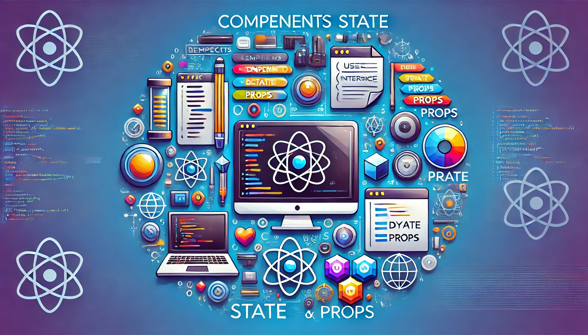

### Introdução ao React: Conceitos Básicos - Componentes, Estado, e Props



#### Componentes

Componentes são a base de qualquer aplicação React. Eles permitem dividir a interface de usuário em partes independentes e reutilizáveis. Existem dois tipos principais de componentes:

1. **Componentes Funcionais:**
   Componentes funcionais são funções JavaScript que aceitam um único argumento chamado `props` (propriedades) e retornam elementos React. Eles são simples e geralmente usados para componentes que não têm estado próprio.

   ```jsx
   function Welcome(props) {
     return <h1>Hello, {props.name}</h1>;
   }
   ```

2. **Componentes de Classe (Desencorajado):**
   Componentes de classe são mais complexos e permitem que você use recursos adicionais, como estado e métodos de ciclo de vida. No entanto, com o advento dos [React Hooks](https://reactjs.org/docs/hooks-intro.html), componentes de classe são desencorajados em favor dos componentes funcionais que utilizam hooks.

#### Estado (State)

O estado é um objeto que representa as partes dinâmicas da interface de usuário. Ele permite que os componentes respondam a eventos e mudem com o tempo. Com os hooks, o estado pode ser gerenciado de forma simples em componentes funcionais usando o hook `useState`.

```jsx
import React, { useState, useEffect } from 'react';

function Clock() {
  const [date, setDate] = useState(new Date());

  useEffect(() => {
    const timerID = setInterval(() => tick(), 1000);
    return () => clearInterval(timerID);
  }, []);

  const tick = () => {
    setDate(new Date());
  };

  return (
    <div>
      <h1>Hello, world!</h1>
      <h2>It is {date.toLocaleTimeString()}.</h2>
    </div>
  );
}
```

#### Propriedades (Props)

As propriedades (props) são argumentos passados para os componentes React, semelhante a como os argumentos são passados para as funções em JavaScript. As props permitem que você passe dados de um componente pai para um componente filho.

```jsx
function Welcome(props) {
  return <h1>Hello, {props.name}</h1>;
}

function App() {
  return (
    <div>
      <Welcome name="Sara" />
      <Welcome name="Cahal" />
      <Welcome name="Edite" />
    </div>
  );
}
```

#### Conclusão

Os conceitos de componentes, estado e props são fundamentais para entender como o React funciona. Componentes permitem construir interfaces modulares e reutilizáveis, o estado permite que os componentes respondam a eventos e mudem dinamicamente, e as props permitem passar dados entre componentes. No próximo tópico, exploraremos o ciclo de vida dos componentes, que é crucial para entender como e quando o estado e as props são manipulados no React.

#### Referências
- [Documentação oficial do React](https://reactjs.org/docs/getting-started.html)
- [Tutorial de componentes e props](https://reactjs.org/docs/components-and-props.html)
- [Estado e ciclo de vida no React](https://reactjs.org/docs/state-and-lifecycle.html)
- [Introdução aos Hooks](https://reactjs.org/docs/hooks-intro.html)
